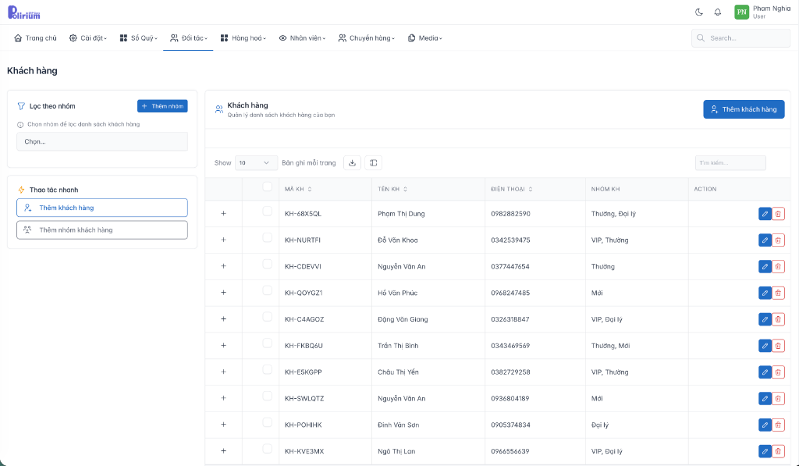

# Professional Table UI Pattern

> **Knowledge Item**: Đây là UI pattern chuẩn cho các trang danh sách trong Polirium.

## Reference Screenshot



---

## Cấu trúc Layout

### 1. Header Section

```
┌─────────────────────────────────────────────────────────────────┐
│ [Title Page]                          [+ Primary Action Button] │
└─────────────────────────────────────────────────────────────────┘
```

- **Title**: Tên module/entity (e.g., "Khách hàng")
- **Primary Action Button**: Nút thêm mới với icon `+` và text (e.g., "+ Thêm khách hàng")
    - Class: `btn btn-primary`
    - Đặt ở góc phải header

### 2. Content Area (Two-Column Layout)

```
┌──────────────────┬──────────────────────────────────────────────┐
│   LEFT SIDEBAR   │              MAIN CONTENT                    │
│   (Filter Panel) │              (Data Table)                    │
│                  │                                              │
│   ┌────────────┐ │  ┌────────────────────────────────────────┐  │
│   │ Lọc theo   │ │  │ [Icon] Title                           │  │
│   │ nhóm       │ │  │ Description                            │  │
│   └────────────┘ │  │                                        │  │
│                  │  │ Show [10 ▼] Bản ghi mỗi trang [↓] [□]  │  │
│   ┌────────────┐ │  │ ┌─────┬─────┬─────┬─────┬───────────┐  │  │
│   │Quick       │ │  │ │ Col │ Col │ Col │ Col │  Actions  │  │  │
│   │Actions     │ │  │ ├─────┼─────┼─────┼─────┼───────────┤  │  │
│   └────────────┘ │  │ │     │     │     │     │ [✎] [🗑]  │  │  │
│                  │  │ └─────┴─────┴─────┴─────┴───────────┘  │  │
└──────────────────┴──────────────────────────────────────────────┘
```

---

## Components

### Left Sidebar (`professional-sidebar`)

#### Filter Section

```blade
<div class="professional-filter-section">
    <div class="professional-filter-header">
        <x-tabler-filter class="icon" />
        Lọc theo nhóm
        <button class="btn btn-sm btn-primary">+ Thêm nhóm</button>
    </div>
    <div class="professional-filter-body">
        <x-ui.form.select
            :options="$groups"
            placeholder="Chọn..."
        />
    </div>
</div>
```

#### Quick Actions Section

```blade
<div class="professional-quick-actions">
    <div class="header">
        <x-tabler-bolt class="icon" />
        Thao tác nhanh
    </div>
    <div class="actions-list">
        <button class="quick-action-btn">
            <x-tabler-user-plus class="icon" />
            Thêm khách hàng
        </button>
        <button class="quick-action-btn">
            <x-tabler-users-group class="icon" />
            Thêm nhóm khách hàng
        </button>
    </div>
</div>
```

### Main Content Area

#### Table Header

```blade
<div class="professional-table-header">
    <div class="left">
        <x-tabler-users class="icon text-primary" />
        <div>
            <h4>{{ $title }}</h4>
            <small class="text-muted">{{ $description }}</small>
        </div>
    </div>
</div>
```

#### Table Toolbar

```blade
<div class="professional-toolbar">
    <div class="left">
        Show
        <select class="form-select form-select-sm">
            <option>10</option>
            <option>25</option>
            <option>50</option>
        </select>
        Bản ghi mỗi trang
        <button class="btn btn-icon btn-ghost"><x-tabler-download /></button>
        <button class="btn btn-icon btn-ghost"><x-tabler-columns /></button>
    </div>
    <div class="right">
        <input type="text" class="form-control" placeholder="Tìm kiếm..." />
    </div>
</div>
```

#### Data Table (Professional Table)

```blade
<table class="professional-table">
    <thead>
        <tr>
            <th></th> {{-- Expand button column --}}
            <th>MÃ KH <x-tabler-arrows-sort class="icon" /></th>
            <th>TÊN KH <x-tabler-arrows-sort class="icon" /></th>
            <th>ĐIỆN THOẠI <x-tabler-arrows-sort class="icon" /></th>
            <th>NHÓM KH</th>
            <th>ACTION</th>
        </tr>
    </thead>
    <tbody>
        @foreach($items as $item)
        <tr>
            <td>
                <button class="btn btn-icon btn-ghost btn-sm expand-row">
                    <x-tabler-plus class="icon" />
                </button>
            </td>
            <td>{{ $item->code }}</td>
            <td>{{ $item->name }}</td>
            <td>{{ $item->phone }}</td>
            <td>
                @foreach($item->groups as $group)
                    <span class="badge bg-secondary">{{ $group->name }}</span>
                @endforeach
            </td>
            <td class="professional-actions">
                <button class="btn btn-icon btn-primary btn-sm">
                    <x-tabler-pencil class="icon" />
                </button>
                <button class="btn btn-icon btn-danger btn-sm">
                    <x-tabler-trash class="icon" />
                </button>
            </td>
        </tr>
        @endforeach
    </tbody>
</table>
```

---

## Action Buttons Pattern

### Row Actions (2 buttons max)

```blade
<td class="professional-actions">
    {{-- Edit --}}
    <button class="btn btn-icon btn-primary btn-sm" wire:click="edit({{ $id }})">
        <x-tabler-pencil class="icon" />
    </button>
    {{-- Delete --}}
    <button class="btn btn-icon btn-danger btn-sm" wire:click="confirmDelete({{ $id }})">
        <x-tabler-trash class="icon" />
    </button>
</td>
```

### Colors

| Action   | Button Class  | Icon              |
| -------- | ------------- | ----------------- |
| Edit     | `btn-primary` | `tabler-pencil`   |
| Delete   | `btn-danger`  | `tabler-trash`    |
| View     | `btn-info`    | `tabler-eye`      |
| Download | `btn-success` | `tabler-download` |

---

## CSS Classes Reference

| Class                          | Description                            |
| ------------------------------ | -------------------------------------- |
| `.professional-table`          | Main table class with zebra striping   |
| `.professional-sidebar`        | Left sidebar panel                     |
| `.professional-filter-section` | Filter panel container                 |
| `.professional-quick-actions`  | Quick actions panel                    |
| `.professional-toolbar`        | Table toolbar with pagination & search |
| `.professional-actions`        | Action buttons cell in table           |
| `.professional-btn-action`     | Action button with loading states      |

---

## Livewire Loading States

### Button với Loading

```blade
<button type="submit" class="professional-btn-action primary"
        wire:loading.attr="disabled"
        wire:target="save">
    <span wire:loading.remove>
        {!! tabler_icon('device-floppy', ['class' => 'icon']) !!}
        {{ __('Lưu') }}
    </span>
    <span wire:loading style="display: none;">
        {!! tabler_icon('loader-2', ['class' => 'icon icon-spin']) !!}
        {{ __('Đang lưu...') }}
    </span>
</button>
```

> **⚠️ QUAN TRỌNG**: Span loading phải có `style="display: none;"` để tránh CSS class override.

---

## Modules đã áp dụng pattern này

- [x] Customer Module (`/admin/customers`)
- [ ] Product Module (`/admin/products`)
- [ ] Vendor Module (`/admin/vendors`)
- [ ] Sale Module (`/admin/sales`)

---

## Checklist khi tạo trang danh sách mới

1. [ ] Có Left Sidebar với filter/quick actions?
2. [ ] Có Table Header với icon + title + description?
3. [ ] Có Toolbar với pagination selector + search?
4. [ ] Có sortable columns với icon arrows-sort?
5. [ ] Có expand button (+) cho mỗi row?
6. [ ] Có Action buttons (Edit/Delete) với icon-only style?
7. [ ] Có Primary Action Button ở góc phải header?
8. [ ] Loading states đúng cách với `style="display: none;"`?
